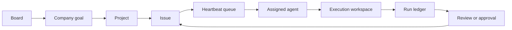

<p align="center">
  
</p>

<h1 align="center">Paperclip runs the work around your agents.</h1>

<p align="center">
  Set company goals, assign work across agent teams, review output, and keep budgets and approvals in one control plane.
</p>

<p align="center">
  <a href="#quickstart"><strong>Quickstart</strong></a> &middot;
  <a href="https://docs.paperclip.ing"><strong>Docs</strong></a> &middot;
  <a href="https://paperclip.ing"><strong>Website</strong></a> &middot;
  <a href="https://discord.gg/m4HZY7xNG3"><strong>Discord</strong></a> &middot;
  <a href="ROADMAP.md"><strong>Roadmap</strong></a>
</p>

<p align="center">
  <a href="LICENSE"></a>
  <a href="https://github.com/paperclipai/paperclip/stargazers"></a>
  <a href="https://discord.gg/m4HZY7xNG3"></a>
</p>

<br />

Paperclip is an open-source control plane for companies built with agents. The board sets direction. Agents receive scoped issues, work inside project workspaces, and return evidence for review. Paperclip keeps the org chart, queue, approvals, costs, and run history attached to the work.

Claude Code, Codex, OpenClaw, CLI processes, and HTTP agents plug into the same company model.

<p align="center">
  
</p>

<p align="center"><sub>The operator dashboard keeps agents, active work, spend, and approvals in view.</sub></p>

## One company record

Paperclip keeps business direction and execution in the same graph.

| Record | Purpose |
| --- | --- |
| **Company goal** | States the result the board expects. |
| **Project** | Binds work to a repository, workspace policy, and project lead. |
| **Issue** | Names the assignment, assignee, dependencies, and review state. |
| **Heartbeat run** | Records the runtime, logs, session, cost, and final disposition. |
| **Approval** | Gives a human the decision when policy requires one. |

Every mutation carries company scope and actor attribution. Agents can resume work without reconstructing the company from a prompt.

## The operator keeps authority

| Control | Paperclip enforces |
| --- | --- |
| **Org structure** | Roles, reporting lines, permissions, and agent status. |
| **Work ownership** | Atomic checkout, blockers, handoffs, and independent review. |
| **Budgets** | Spend tracking, warning thresholds, and hard stops. |
| **Governance** | Hiring approvals, execution policies, pause, resume, and termination. |
| **Company boundaries** | Scoped entities, secrets, workspaces, and audit history. |
| **Recovery** | Durable queues, run reconciliation, and explicit failure states. |

<p align="center">
  
</p>

<p align="center"><sub>An execution workspace keeps the branch, changed files, runtime state, and review surface together.</sub></p>

## Agent adapters

<div align="center">
<table>
  <tr>
    <td align="center"><br /><sub>OpenClaw</sub></td>
    <td align="center"><br /><sub>Claude Code</sub></td>
    <td align="center"><br /><sub>Codex</sub></td>
    <td align="center"><br /><sub>CLI agents</sub></td>
    <td align="center"><br /><sub>Processes</sub></td>
    <td align="center"><br /><sub>HTTP</sub></td>
  </tr>
</table>
</div>

Adapters receive the issue, workspace, run identity, and scoped environment selected by Paperclip. They return structured output to the run ledger.

### Subscription-only local execution

The built-in Claude Code and Codex adapters can enforce `billingPolicy: subscription_only`. This mode accepts verified local account credentials and fails before launch when it finds metered keys, custom providers, unsupported targets, transport interception, or unverifiable auth.

The capability reports local preflight classification. Provider billing receipts sit outside this contract. ACP, remote, sandbox, and container targets remain unavailable under this policy until the execution host can enforce the same boundary.

Read the adapter contracts:

- [Claude Code local adapter](docs/adapters/claude-local.md)
- [Codex local adapter](docs/adapters/codex-local.md)

## How a run moves



The server owns task state and policy. An adapter owns provider execution. Project work stays in its workspace, and reviewers receive the run evidence before they decide.

<div align="center">
  <video src="https://github.com/user-attachments/assets/773bdfb2-6d1e-4e30-8c5f-3487d5b70c8f" width="720" controls></video>
</div>

## Quickstart

Paperclip is self-hosted. The default onboarding path uses trusted local loopback mode and creates an embedded PostgreSQL database.

### Install with a verified script

```bash
curl -fsSLO https://paperclip.ing/install.sh
curl -fsSLO https://paperclip.ing/install.sh.sha256

if command -v sha256sum >/dev/null 2>&1; then
  sha256sum -c install.sh.sha256
else
  shasum -a 256 -c install.sh.sha256
fi

bash install.sh
```

The installer checks for Node.js 20 or newer, installs the managed Paperclip CLI under `~/.paperclip/cli`, and starts onboarding. Supported macOS and Linux hosts can install Paperclip as a background service.

The checksum and script share an origin. Use a release tag or commit-pinned GitHub copy when your policy requires an independent source.

### Try it without a permanent install

```bash
npx --registry https://registry.npmjs.org paperclipai onboard --yes
```

### Run from source

```bash
git clone https://github.com/paperclipai/paperclip.git
cd paperclip
pnpm install
pnpm dev
```

The API starts at `http://localhost:3100`. Paperclip creates the embedded database on first run.

**Requirements:** Node.js 20 or newer, pnpm 9.15 or newer.

Use `paperclipai configure` to change an existing setup. [`doc/INSTALLING.md`](doc/INSTALLING.md) covers pinned versions, updates, rollback, services, and uninstalling.

## Deployment

A local installation runs the API, embedded PostgreSQL, and file storage in one Node.js process. Production installations can use an external PostgreSQL database and object storage.

Paperclip supports multiple companies in one deployment. Company scope follows agents, projects, issues, secrets, runs, costs, and activity records.

Use a bind preset during onboarding when the server must leave loopback:

```bash
paperclipai onboard --yes --bind lan
# or
paperclipai onboard --yes --bind tailnet
```

## Development

```bash
pnpm dev              # API and UI in watch mode
pnpm dev:once         # API and UI without file watching
pnpm dev:server       # API only
pnpm dev:mobile       # Prebuilt UI on :3101, proxying /api to :3100
pnpm dev:both         # Desktop and mobile development servers
pnpm build            # Production build
pnpm typecheck        # TypeScript checks
pnpm test             # Vitest suite
pnpm test:watch       # Vitest watch mode
pnpm test:e2e         # Playwright suite
pnpm db:generate      # Generate a database migration
pnpm db:migrate       # Apply migrations
```

`pnpm test` runs Vitest. Browser tests remain in `pnpm test:e2e`.

The [development guide](doc/DEVELOPING.md) covers repository layout, local services, database work, and test conventions.

## Project references

| Resource | Use it for |
| --- | --- |
| [Documentation](https://docs.paperclip.ing) | Installation and operator guidance. |
| [Roadmap](ROADMAP.md) | Shipped work and planned product areas. |
| [Contributing guide](CONTRIBUTING.md) | Pull requests, tests, and repository standards. |
| [Install guide](doc/INSTALLING.md) | Version pinning, service control, updates, and rollback. |
| [Development guide](doc/DEVELOPING.md) | Local setup and engineering workflow. |
| [Telemetry contract](packages/shared/src/telemetry/README.md) | Event schema and data handling. |

## Observability

The server supports opt-in OpenTelemetry traces. Set `OTEL_EXPORTER_OTLP_ENDPOINT` and choose `grpc`, `http/protobuf`, or `http/json` through `OTEL_EXPORTER_OTLP_PROTOCOL`. The OpenTelemetry packages remain optional peer dependencies. [The observability guide](doc/observability.md) lists the packages and environment variables.

## Telemetry

Paperclip sends anonymous product telemetry by default. Events exclude issue content, prompts, file paths, secrets, and personal information. The client hashes private repository references with a per-install salt.

Disable telemetry through any supported control:

| Control | Value |
| --- | --- |
| Environment | `PAPERCLIP_TELEMETRY_DISABLED=1` |
| Standard convention | `DO_NOT_TRACK=1` |
| CI | `CI=true` disables telemetry |
| Config file | `telemetry.enabled: false` |

Contributors who add or change events must follow the [Telemetry Data Contract](packages/shared/src/telemetry/README.md) and [Telemetry Workflow](doc/TELEMETRY_WORKFLOW.md).

## Community

- [Discord](https://discord.gg/m4HZY7xNG3)
- [GitHub Discussions](https://github.com/paperclipai/paperclip/discussions)
- [GitHub Issues](https://github.com/paperclipai/paperclip/issues)
- [Plugin directory](https://github.com/gsxdsm/awesome-paperclip)
- [Updates on X](https://x.com/papercliping)

## License

Paperclip is available under the [MIT License](LICENSE). Copyright 2026 [Paperclip Labs, Inc.](https://paperclip.ing)

---

<p align="center"><sub>Open source. Self-hosted. Built for operators who want accountable agent work.</sub></p>
